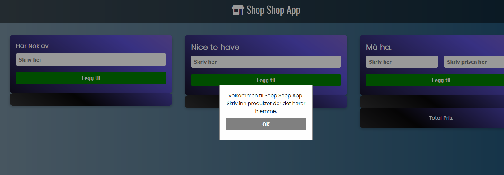
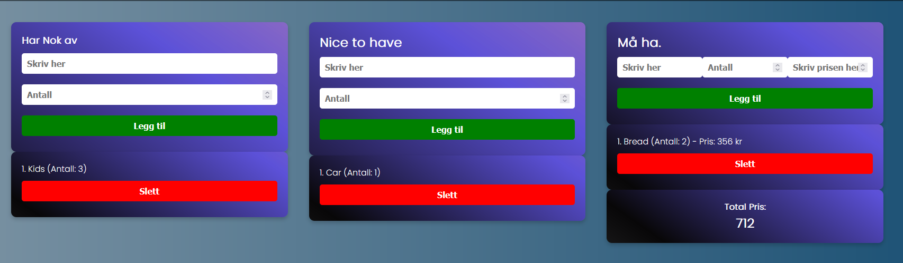

# ShoppingList Mandatory assignment Javascript

Velkommen til ShoppingList Mandatory assignment Javascript! Dette er et enkelt webapplikasjonsprosjekt hvor du kan administrere handlelister i forskjellige kategorier. Dette prosjektet er utviklet som en del av et JavaScript-arbeidskrav.

## Funksjoner

- **Legg til produkter i kategorier**: Administrer produkter i tre forskjellige kategorier: "Har Nok av", "Nice to have", og "Må ha".
- **Slett produkter**: Fjern produkter fra listene når du ikke trenger dem lenger.
- **Total prisberegning**: Beregn total prisen for produkter som må kjøpes.

## Installasjon

1. **Klon repositoriet**:

     git clone https://github.com/TommyS-NO/ShoppingList-Mandatory-assignment-Javascript.git

2. **Naviger til prosjektmappen**:
 
    cd <repo-navn>

3. **Åpne `index.html` i din nettleser**.

## Bruk

1. **Legg til produkter**:
   - Skriv inn produktnavnet i riktig kategori og klikk "Legg til".
   - For kategorien "Må ha", skriv også inn prisen for produktet.

2. **Slett produkter**:
   - Klikk "Slett" ved siden av produktet og bekreft slettingen.

## Teknologi

- HTML
- CSS
- JavaScript

## Forhåndsvisning

## Lisens

Dette prosjektet er lisensiert under MIT-lisensen.

---
